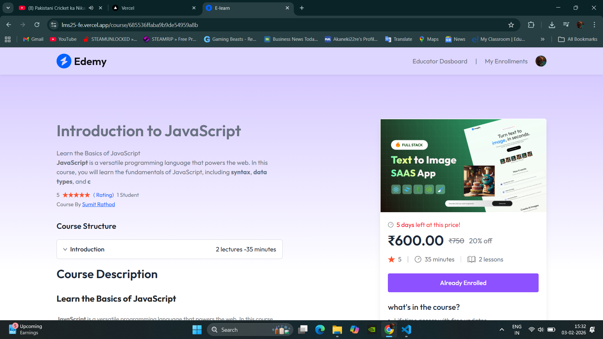

# LMS25 - Learning Management System

A full-stack Learning Management System (LMS) built with modern web technologies. It enables educators to create and manage courses, and students to enroll and learn from these courses with integrated payment processing.

 <!-- Replace with actual screenshot -->

## 📋 Table of Contents

- [Project Overview](#project-overview)
- [Tech Stack](#tech-stack)
- [System Requirements](#system-requirements)
- [Installation Guide](#installation-guide)
- [Environment Configuration](#environment-configuration)
- [Running the Project](#running-the-project)
- [Project Structure](#project-structure)
- [Features](#features)
- [Key Dependencies & Links](#key-dependencies--links)
- [API Endpoints](#api-endpoints)
- [Deployment](#deployment)

---

## 🎯 Project Overview

LMS25 is a comprehensive learning platform that allows:

- **Educators** to create, manage, and monitor courses with structured chapters and lectures
- **Students** to browse, enroll, and access course content with progress tracking
- **Payment Integration** using Stripe for seamless course purchases
- **Authentication** using Clerk for secure user management
- **Media Management** using Cloudinary for storing course thumbnails and videos

---

## 🛠 Tech Stack

### Frontend

- **Framework**: React 19.1.0
- **Build Tool**: Vite 6.3.5
- **Styling**: Tailwind CSS 4.1.8
- **State Management**: React Context API
- **HTTP Client**: Axios
- **Authentication**: Clerk React
- **Video Player**: React YouTube
- **Rich Text Editor**: Quill 2.0.3
- **UI Components**: React Toastify, React Simple Star Rating
- **Router**: React Router DOM

### Backend

- **Runtime**: Node.js
- **Framework**: Express 5.1.0
- **Database**: MongoDB with Mongoose
- **Authentication**: Clerk Express
- **Payment Processing**: Stripe
- **File Upload**: Multer
- **Cloud Storage**: Cloudinary
- **Webhooks**: Svix
- **Development**: Nodemon

---

## 📦 System Requirements

- **Node.js**: v18.0.0 or higher
- **npm**: v9.0.0 or higher
- **MongoDB**: Local or cloud instance (MongoDB Atlas recommended)
- **Git**: For version control

---

## 🚀 Installation Guide

### Step 1: Clone the Repository

```bash
git clone https://github.com/SR22kl/SR22kl_LMS-25.git
cd LMS25
```

### Step 2: Install Backend Dependencies

```bash
cd BE
npm install
```

### Step 3: Install Frontend Dependencies

```bash
cd ../FE
npm install
```

---

## 🔐 Environment Configuration

### Backend Environment (.env in BE folder)

Create a `.env` file in the `BE` directory with the following variables:

```env
# Server Configuration
PORT=5000
NODE_ENV=development

# MongoDB Configuration
MONGODB_URI=mongodb+srv://<your_username>:<your_password>@<cluster>.mongodb.net/

# Clerk Authentication
CLERK_SECRET_KEY=your_clerk_secret_key
CLERK_PUBLISHABLE_KEY=your_clerk_publishable_key

# Cloudinary Configuration
CLOUDINARY_NAME=your_cloudinary_name
CLOUDINARY_API_KEY=your_cloudinary_api_key
CLOUDINARY_API_SECRET=your_cloudinary_api_secret

# Stripe Configuration
STRIPE_SECRET_KEY=your_stripe_secret_key
STRIPE_PUBLISHABLE_KEY=your_stripe_publishable_key
STRIPE_WEBHOOK_SECRET=your_stripe_webhook_secret

# Frontend URL (for CORS)
FRONTEND_URL=http://localhost:5173
```

### Frontend Environment (.env in FE folder)

Create a `.env` file in the `FE` directory with the following variables:

```env
VITE_CLERK_PUBLISHABLE_KEY=your_clerk_publishable_key
VITE_API_URL=http://localhost:5000
```

### How to Get These Credentials

1. **Clerk**
   - Visit https://dashboard.clerk.com
   - Create a new application
   - Copy your Secret and Publishable keys

2. **MongoDB**
   - Visit https://www.mongodb.com/cloud/atlas
   - Create a free cluster
   - Get your connection string

3. **Cloudinary**
   - Visit https://cloudinary.com
   - Create a free account
   - Get your Cloud Name, API Key, and API Secret from the dashboard

4. **Stripe**
   - Visit https://dashboard.stripe.com
   - Create a new account
   - Get your keys from the API section
   - Get webhook secret after setting up webhooks

---

## ▶️ Running the Project

### Development Mode

**Terminal 1: Start Backend Server**

```bash
cd BE
npm run dev
```

Backend will run on `http://localhost:5000`

**Terminal 2: Start Frontend Development Server**

```bash
cd FE
npm run dev
```

Frontend will run on `http://localhost:5173`

### Production Build

**Frontend Build**

```bash
cd FE
npm run build
npm run preview
```

**Backend Start**

```bash
cd BE
npm start
```

---

## 📁 Project Structure

```
LMS25/
├── BE/                          # Backend
│   ├── configs/
│   │   ├── mongodb.js          # MongoDB connection
│   │   ├── cloundinary.js       # Cloudinary setup
│   │   └── multer.js            # File upload configuration
│   ├── controllers/
│   │   ├── userController.js    # User operations
│   │   ├── courseController.js  # Course operations
│   │   ├── educatorController.js # Educator operations
│   │   └── webhooks.js          # Clerk & Stripe webhooks
│   ├── middlewares/
│   │   └── authMiddleware.js    # Authentication middleware
│   ├── models/
│   │   ├── userModel.js         # User schema
│   │   ├── courseModel.js       # Course schema
│   │   ├── courseProgress.js    # Course progress tracking
│   │   └── purchaseModel.js     # Purchase records
│   ├── routes/
│   │   ├── userRoutes.js        # User endpoints
│   │   ├── courseRoutes.js      # Course endpoints
│   │   └── educatorRoutes.js    # Educator endpoints
│   ├── server.js                # Express app setup
│   ├── package.json
│   └── vercel.json
│
└── FE/                          # Frontend
    ├── src/
    │   ├── assets/              # Static assets and icons
    │   ├── components/
    │   │   ├── educator/        # Educator components
    │   │   └── student/         # Student components
    │   ├── context/
    │   │   └── AppContext.jsx   # Global app context
    │   ├── pages/
    │   │   ├── educator/        # Educator pages
    │   │   └── student/         # Student pages
    │   ├── App.jsx
    │   ├── main.jsx
    │   └── index.css
    ├── vite.config.js
    ├── package.json
    ├── vercel.json
    └── index.html
```

---

## ✨ Features

### For Educators

- ✅ Create and manage courses
- ✅ Add structured chapters and lectures
- ✅ Upload course thumbnails and video lectures
- ✅ Set course pricing and discounts
- ✅ Track student enrollments
- ✅ View student progress
- ✅ Rich text editor for course descriptions

### For Students

- ✅ Browse and search courses
- ✅ View detailed course information with ratings
- ✅ Enroll in courses with Stripe payment
- ✅ Watch video lectures
- ✅ Preview selected lectures for free
- ✅ Track course progress
- ✅ Leave ratings and reviews
- ✅ Access personal enrollment history

### General Features

- ✅ Secure authentication with Clerk
- ✅ Responsive design with Tailwind CSS
- ✅ Real-time error notifications
- ✅ Image optimization with Cloudinary
- ✅ Payment processing with Stripe
- ✅ Webhook integrations for real-time updates
- ✅ Role-based access control

---

## 📚 Key Dependencies & Links

### Frontend Libraries

| Package            | Version | Purpose             | Link                                         |
| ------------------ | ------- | ------------------- | -------------------------------------------- |
| react              | 19.1.0  | UI Library          | https://react.dev                            |
| vite               | 6.3.5   | Build Tool          | https://vitejs.dev                           |
| tailwindcss        | 4.1.8   | Utility CSS         | https://tailwindcss.com                      |
| axios              | 1.10.0  | HTTP Client         | https://axios-http.com                       |
| react-router-dom   | 7.6.1   | Routing             | https://reactrouter.com                      |
| @clerk/clerk-react | 5.31.8  | Authentication      | https://clerk.com                            |
| quill              | 2.0.3   | Rich Text Editor    | https://quilljs.com                          |
| react-youtube      | 10.1.0  | YouTube Player      | https://github.com/tjallingt/react-youtube   |
| react-toastify     | 11.0.5  | Notifications       | https://fkhadra.github.io/react-toastify     |
| humanize-duration  | 3.32.2  | Duration Formatting | https://github.com/yuselix/humanize-duration |
| uniqid             | 5.4.0   | Unique ID Generator | https://www.npmjs.com/package/uniqid         |

### Backend Libraries

| Package        | Version | Purpose               | Link                                |
| -------------- | ------- | --------------------- | ----------------------------------- |
| express        | 5.1.0   | Web Framework         | https://expressjs.com               |
| mongoose       | 8.15.1  | MongoDB ODM           | https://mongoosejs.com              |
| @clerk/express | 1.6.0   | Auth Middleware       | https://clerk.com                   |
| stripe         | 18.2.1  | Payment Processing    | https://stripe.com                  |
| cloudinary     | 2.6.1   | Cloud Storage         | https://cloudinary.com              |
| multer         | 2.0.1   | File Upload           | https://github.com/expressjs/multer |
| cors           | 2.8.5   | CORS Middleware       | https://github.com/expressjs/cors   |
| dotenv         | 16.5.0  | Environment Variables | https://github.com/motdotla/dotenv  |
| svix           | 1.42.0  | Webhooks              | https://www.svix.com                |
| nodemon        | 3.1.10  | Dev Auto-reload       | https://nodemon.io                  |

---

## 🔌 API Endpoints

### User Routes (`/api/user`)

- `POST /purchase` - Initiate course purchase (requires payment)
- `POST /enroll-free` - Enroll in free course
- `GET /enrollments` - Get user's enrolled courses
- `POST /rate-course` - Rate a course

### Course Routes (`/api/course`)

- `GET /` - Get all courses
- `GET /:id` - Get course details
- `GET /:id/content` - Get course content (if enrolled)

### Educator Routes (`/api/educator`)

- `POST /add-course` - Create new course
- `GET /courses` - Get educator's courses
- `PUT /course/:id` - Update course
- `DELETE /course/:id` - Delete course
- `GET /students` - Get enrolled students list

---

## 🌐 Deployment

### Frontend Deployment (Vercel)

1. Push code to GitHub
2. Go to https://vercel.com
3. Connect your GitHub repository
4. Add environment variables
5. Deploy

**vercel.json** is pre-configured for optimal Vite deployment

### Backend Deployment (Vercel)

1. Update MongoDB URI to use MongoDB Atlas
2. Update all environment variables
3. Deploy using Vercel CLI or GitHub integration

```bash
vercel deploy
```

### Important Deployment Notes

- Update `FRONTEND_URL` in backend .env for CORS
- Update `VITE_API_URL` in frontend .env to point to deployed backend
- Ensure all webhook URLs are updated in Clerk and Stripe dashboards
- Use HTTPS URLs for production

---

## 🐛 Troubleshooting

### Common Issues

**MongoDB Connection Error**

- Verify connection string in .env
- Check MongoDB Atlas network access (whitelist IP)
- Ensure database name is correct

**Clerk Authentication Issues**

- Verify Clerk keys are correct
- Check CORS settings
- Clear browser cookies and local storage

**Stripe Payment Issues**

- Use test mode keys during development
- Verify webhook URLs are correct
- Check Stripe dashboard for failed webhooks

**Cloudinary Upload Issues**

- Verify API credentials
- Check file size limits
- Ensure proper folder structure

---

## 📝 Environment Variables Checklist

- [ ] MongoDB URI configured
- [ ] Clerk keys added (both Secret and Publishable)
- [ ] Cloudinary credentials set
- [ ] Stripe keys configured
- [ ] Frontend URL set in backend
- [ ] Backend URL set in frontend
- [ ] Webhook secrets generated

---

## 🎓 Learning Resources

- [React Documentation](https://react.dev)
- [Express.js Guide](https://expressjs.com)
- [MongoDB University](https://university.mongodb.com)
- [Stripe Developer Docs](https://stripe.com/docs)
- [Clerk Documentation](https://clerk.com/docs)
- [Tailwind CSS](https://tailwindcss.com/docs)

---

## 📄 License

This project is licensed under the ISC License - see the LICENSE file for details.

---

## 👥 Contributors

- Sumit Rathod - [GitHub](https://github.com/SR22kl)

## 👥 Support


For issues and questions:

1. Check the troubleshooting section
2. Review API documentation
3. Create an issue in the repository
4. Contact the development team

For other issues, questions, or suggestions, please open an issue on GitHub.

---

**Happy Coding! 🎬🍿**

